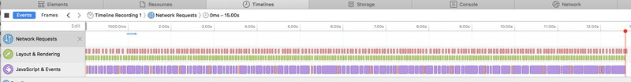
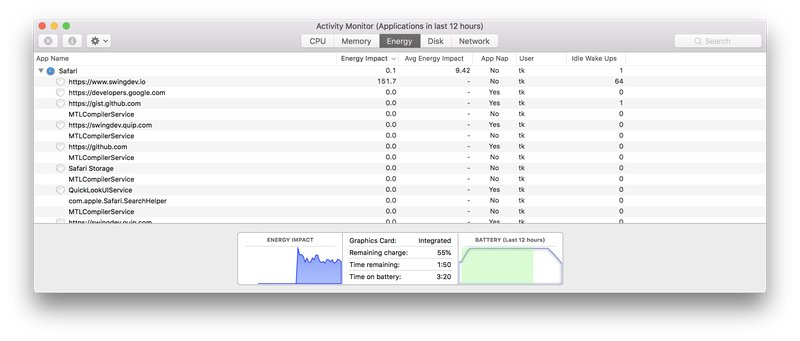

Battery performance matters
===========================

Background
----------

As we already concluded - majority of our users browse the web on their phones. How about the others? Well - they use laptops. See the common thing here?

Pretty much ALL of your users run on battery power!

Now - battery capacity is very limited, and we did not find any meaningful way of increasing the density of battery cells in the last 10 years.

So how does a MacBook last 12h on battery power? Easy - by switching off hardware that's not used and underclocking the hardware that's barely used.

Our job? Use the least possible resources to get the job done and idle on idle.

I'm sure you've seen how all the websites whose income is based on ads affect your browser. Don't be that website.

Rules
-----

### cpu usage

*   Do not use CPU when the website is idle, or use it the least possible way.  
    
    *   Example of an idle website redrawing all the time (in this case - still redrawing canvas after the animation is finished):  
        

