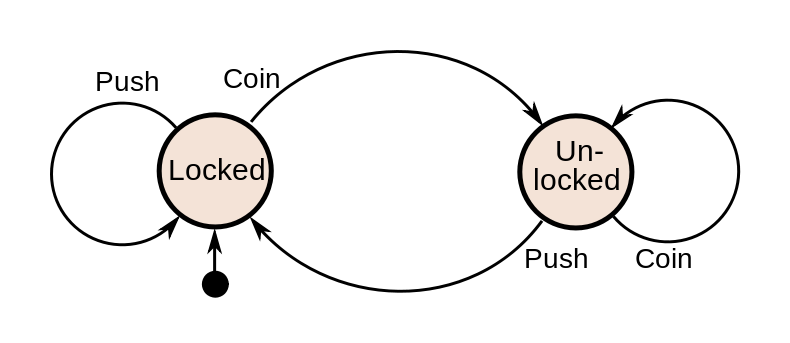

Finite State Machines
=====================

Background
----------

[https://en.wikipedia.org/wiki/Finite-state_machine](https://en.wikipedia.org/wiki/Finite-state_machine)

We utilize them to keep state of the application consistent and deterministic.

By limiting what actions do and when we prevent side effects of asynchronous actions being completed at unexpected times.

They also simplify complex step-by-step or multi-variable logic by dividing it into small independent pieces orchestrated by other small independent pieces.

For complex flows - use FSM that uses state of other FSMs - to keep complex flows simple.

Same principles apply to UI components behavior orchestration, just on a micro UI level.

Architecture
------------

*   State is the single source of truth for 'where the application / module / view / logic' is now.  
    
*   Conditions that make the state transition from X to Y are well defined. If they happen → state transition is made, and the hooks are fired.  
    
*   No other condition cause the state to change.  
    
*   FSMs can watch other FMS's state, and use it as their own conditions.  
    

Typical use cases:
------------------

### Usual leaf FSM graph

*   started → processing  
    
*   processing → success  
    
*   processing → failed (retry logic to go back to processing) → failure  
    

### Usual non-leaf FSM graph

*   started → fetching_data (combines a few leaf FSMs)  
    
*   fetching\_data → waiting\_for\_subFSMs\_success  
    
*   waiting\_for\_subFSMs_success →  success  
    
*   <any state> → failure  
    
*   retry logic can also be handled on this level, esp. if you need to retry the whole flow, or do rollbacks  
    

### Usual orchestrating app logic top-level graph:

*   started → step1   
    
*   step1 → step2  
    
*   step2 → step1  
    
*   step2 → step3  
    
*   step3 → step2  
    
*   step3 → success  
    
*   note that failure is usually not handled at this level, as it should have been handled by sub-FSMs on their level (e.g. single-step level), or just by exiting this particular flow