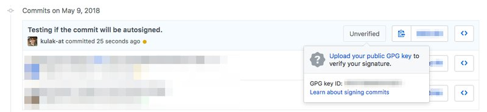
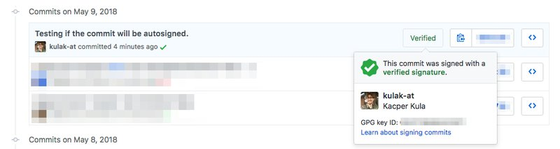

Git
===

Background
----------

Git is the tool we use everyday. For many this might sound obvious, but it is still worth mentioning. Try to use git whenever possible, even if you are bootstrapping very small project with just few lines of code - this is really benefitial.

Rules
-----

*   Commit Often  
    
    *   Git is a great tool if you commit small changes often. It helps both with rollbacks, identifying potential source of error and helps the reviewer follow your train of thought.  
        
*   Use git-flow  
    
    *   Whenever possible, use git-flow for your projects.   
        
*   Make useful commit messages  
    
    *   It is easy, when in rush, to commit the code with the message like “Fix”, but this ruins the whole idea of having history of the commits. Imagine that in the near future you might need to decide if this commit is a part of a bigger story and should be merged to the main branch or not - is this message helpful?  
        
*   Don't Panic  
    
    *   Some parts might be overwhelming. It seems simple at the surface but sometimes it might backfire. Remember, as long as you pushed your code to the remote server, your changes are safe.   
        

How to commit your code?
------------------------

When you are finished with current work it’s worth to commit it. You should commit a separate, working piece of code, which can be easily reverted without any harm. That’s why it’s good to make your commit atomic. Below are good articles about atomic commits:

*   [https://www.freshconsulting.com/atomic-commits/](https://www.freshconsulting.com/atomic-commits/)  
    
*   [http://adopteungit.fr/en/methodology/2017/04/26/how-to-do-atomic-commits.html](http://adopteungit.fr/en/methodology/2017/04/26/how-to-do-atomic-commits.html)  
    

After you staged your changes it’s worth to add meaningful commit message, so that other developers will know what you did. Here are some tips how you can do it:

*   [https://chris.beams.io/posts/git-commit/](https://chris.beams.io/posts/git-commit/)  
    
*   [https://robots.thoughtbot.com/5-useful-tips-for-a-better-commit-message](https://robots.thoughtbot.com/5-useful-tips-for-a-better-commit-message)  
    

Below is a git commit template that we use in our company. Setup it for you local environment:

  
\# If applied, this commit will: ⇧       ...limit ⇥    ...hard limit ⇥  
  
Reason:  
  
Relates to:  
  
\# RULES:  
\# 1\. Separate subject from body with a blank line  
\# 2\. Limit the subject line to 50 characters (69 is a hard limit)  
\# 3\. Capitalize the subject line  
\# 4\. Do not end the subject line with a period  
\# 5\. Use the imperative mood in the subject line  
\# 6\. Wrap the body at 72 characters  
\# 7\. Use the body to explain what and why vs. how

See how you can add this commit template to your git setup [here](https://robots.thoughtbot.com/better-commit-messages-with-a-gitmessage-template).

How to Create Pull Request
--------------------------

Pull Request tells other developers what changes you want to include into core codebase. Making meaningful Pull Request descriptions helps your teammates understand what changes you want to introduce. Here are some tips how to write good Pull Requests. If your project have a standard pull request format, stick with it! Below you can find useful materials:

*   [https://blog.github.com/2015-01-21-how-to-write-the-perfect-pull-request/](https://blog.github.com/2015-01-21-how-to-write-the-perfect-pull-request/)  
    
*   [http://blog.ploeh.dk/2015/01/15/10-tips-for-better-pull-requests/](http://blog.ploeh.dk/2015/01/15/10-tips-for-better-pull-requests/)  
    
*   [https://readwrite.com/2014/07/02/github-pull-request-etiquette/](https://readwrite.com/2014/07/02/github-pull-request-etiquette/)  
    

Code Review
-----------

Always do code review. If you are a single developer working on a project, find other developer who can make you quick code review. It is essential to have someone reviewing your code for several reasons. Firstly, it is easier to someone to criticise your solutions and find some pitfalls you might fall into. Also, it forces you to write clear, readable and consistent code.

Sign Your Git Commits
---------------------

GitHub provides an easy way to sign your commits. It adds additional security level. To do so, first generate your key and setup it on your local machine:

    gpg --gen-key

    git config --global user.signingkey 0A46826A

If you want to autosign all the commits for your current project, use the following command in the project directory:

    git config commit.gpgsign true

If you want to setup autosign globally and make all commits you are making signed by the GPG key, add --global flag.

Then you can setup the key on your GitHub account:

All you need to do now is to add your public GPG key:

gpg —armor —export KEYID

